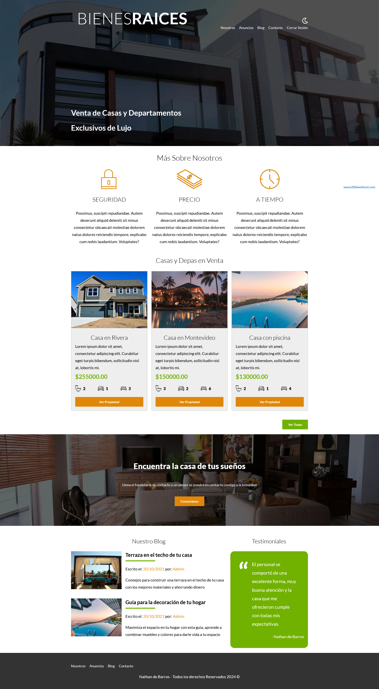
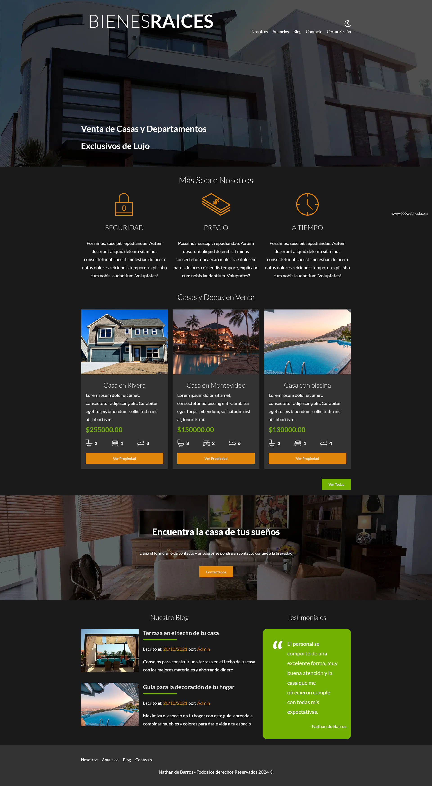
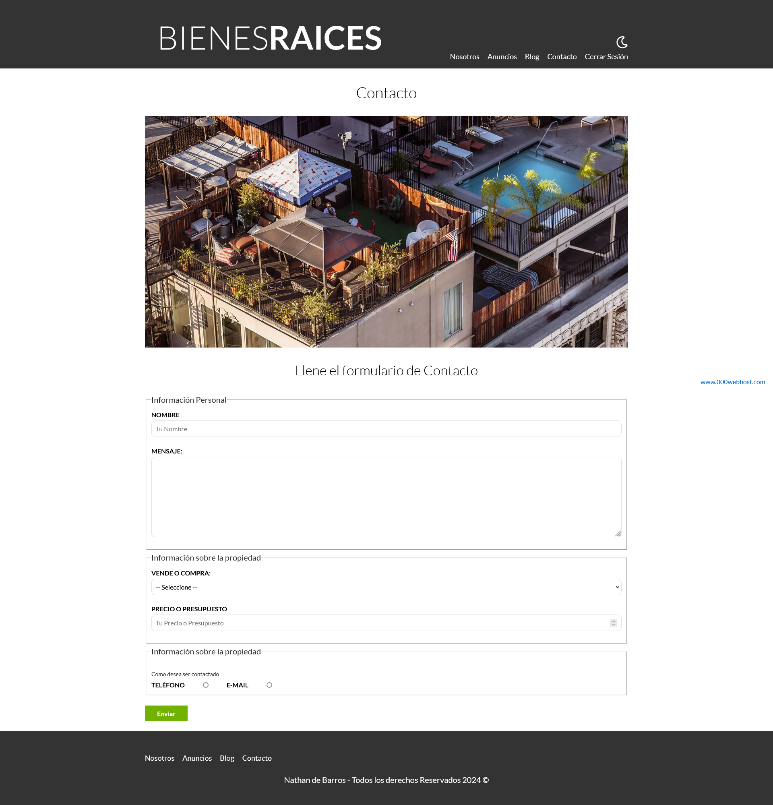
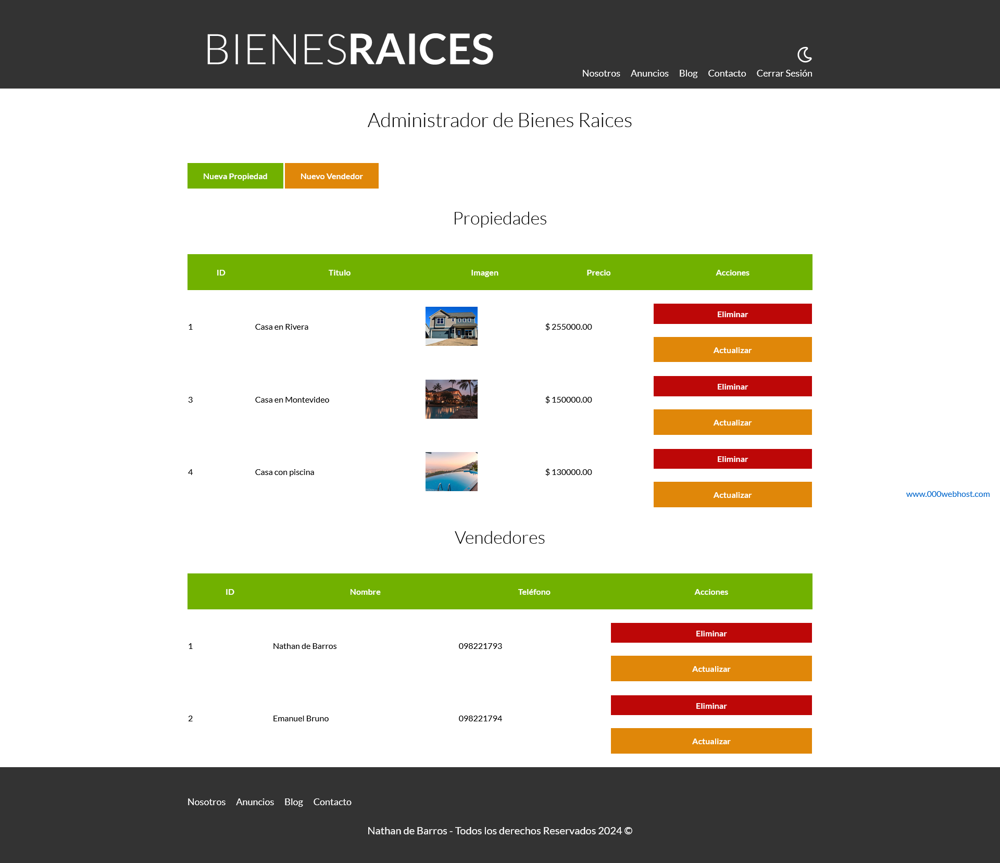
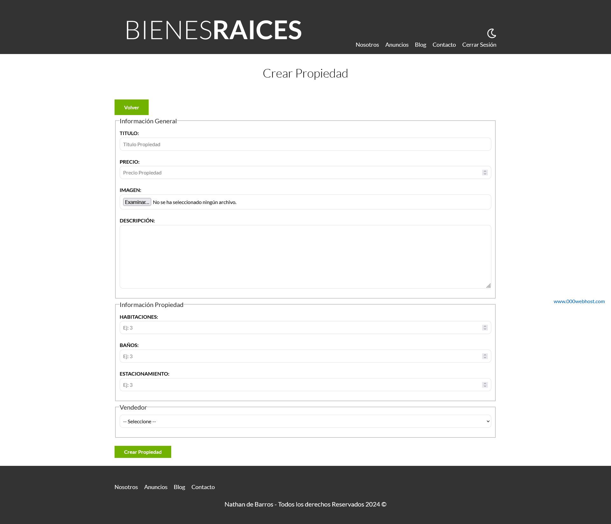
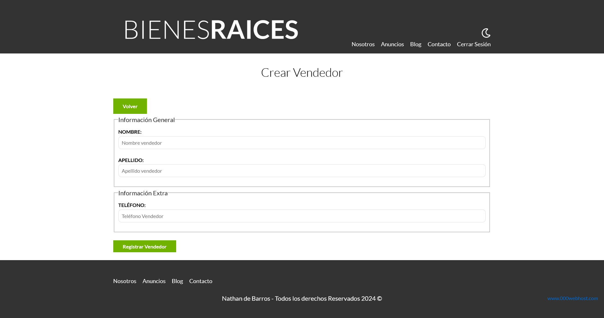

# Proyecto de Bienes Raíces

Este repositorio contiene el código fuente de un proyecto de bienes raíces desarrollado con HTML, SASS, Gulp, PHP, y MySQL, utilizando el patrón de diseño MVC (Modelo-Vista-Controlador).

## Descripción del Proyecto

El objetivo de este proyecto es crear una plataforma web para la gestión y visualización de bienes raíces. La aplicación permite a los usuarios buscar, listar y obtener información detallada sobre propiedades inmobiliarias, así como realizar consultas y contactar a los agentes inmobiliarios.

## Tecnologías Utilizadas

- **HTML**: Utilizado para la estructura de las páginas web.
- **SASS**: Preprocesador de CSS que facilita la organización y mantenimiento del estilo.
- **Gulp**: Herramienta para automatizar tareas como la compilación de SASS y la optimización de imágenes.
- **PHP**: Lenguaje de programación del lado del servidor para la implementación de la lógica de negocio.
- **MySQL**: Sistema de gestión de bases de datos para almacenar y recuperar información.
- **MVC (Modelo-Vista-Controlador)**: Patrón de diseño que divide la aplicación en tres componentes principales para facilitar la escalabilidad y el mantenimiento.

## Capturas del Proyecto

