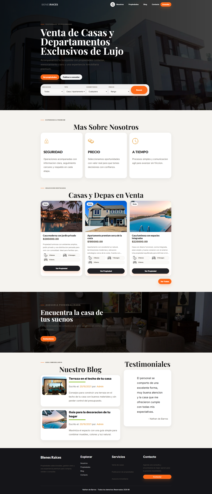
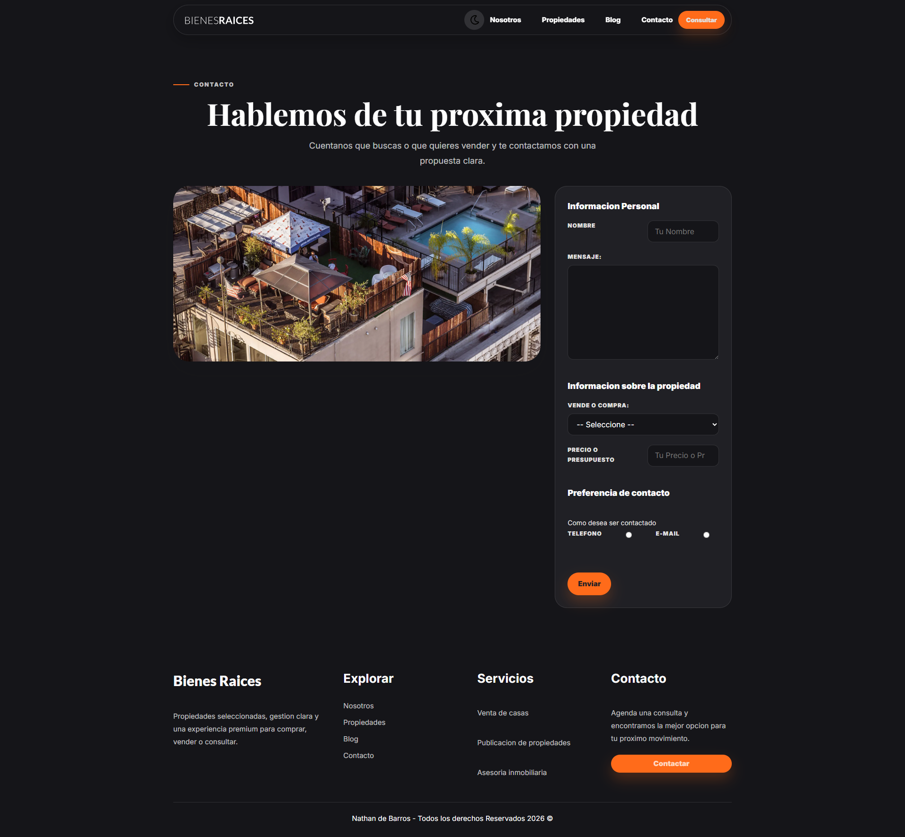
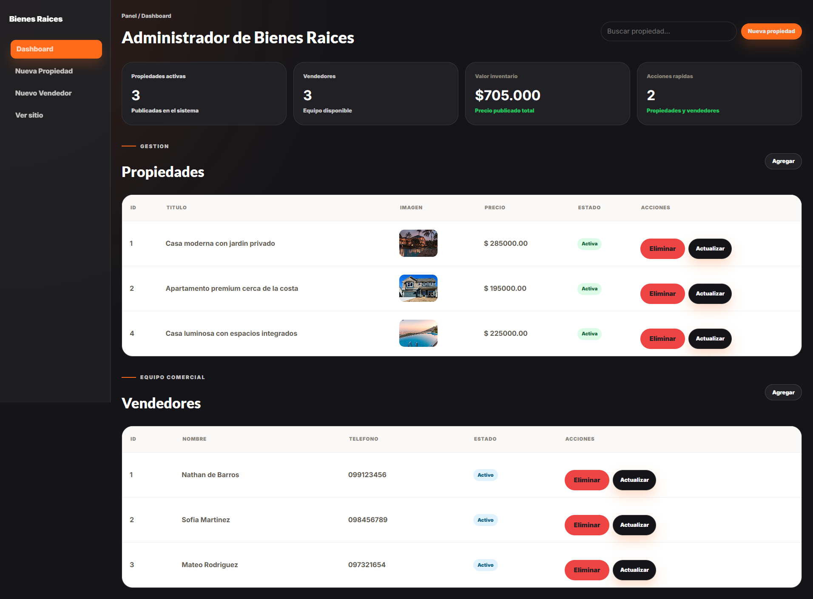
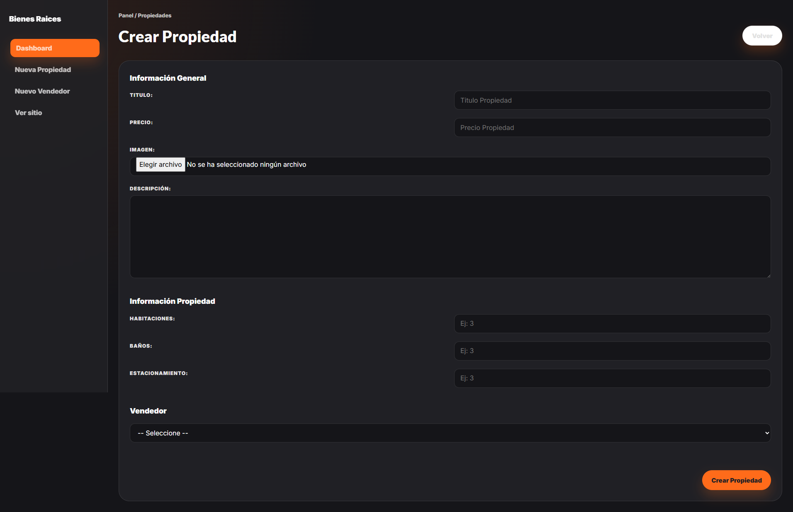
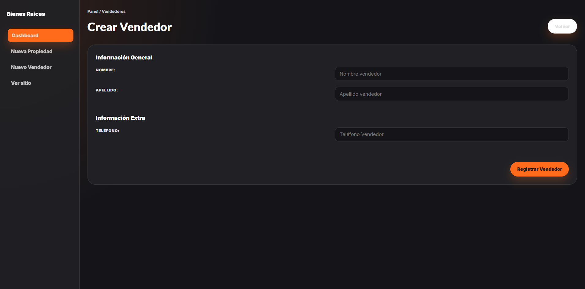

# Proyecto de Bienes Raices

Proyecto web inmobiliario desarrollado con PHP, HTML, JavaScript, Sass, Gulp y MySQL, utilizando arquitectura MVC.

Inicialmente fue hecho como parte del curso [Desarrollo Web Completo con HTML5, CSS3, JS, PHP y MySQL](https://www.udemy.com/course/desarrollo-web-completo-con-html5-css3-js-php-y-mysql/?couponCode=MT260615G). Luego fue redisenado, personalizado y modernizado por **Nathan de Barros**.

## Descripcion del Proyecto

El objetivo de este proyecto es ofrecer una plataforma para la gestion y visualizacion de propiedades inmobiliarias. La aplicacion permite listar propiedades, ver informacion detallada, contactar por consultas y administrar propiedades y vendedores desde un panel privado.

## Tecnologias Utilizadas

- **HTML**: estructura de las paginas web.
- **Sass**: organizacion y mantenimiento de estilos.
- **JavaScript**: interacciones visuales, menu responsive, modo oscuro y animaciones.
- **Gulp**: automatizacion de compilacion de assets.
- **PHP**: logica del lado del servidor.
- **MySQL**: almacenamiento y consulta de informacion.
- **MVC**: separacion de responsabilidades entre modelos, vistas y controladores.

## Rediseño

El rediseño actual incorpora una interfaz publica con estetica inmobiliaria premium y un panel administrativo moderno tipo dashboard, manteniendo la logica base del proyecto original.

## Instalacion Inicial

1. Instalar dependencias PHP:

```bash
composer install
```

2. Crear el archivo de entorno:

```bash
cp includes/.env.example includes/.env
```

En Windows tambien puedes copiar `includes/.env.example` manualmente como `includes/.env`.

3. Importar la base de datos inicial:

```bash
mysql -u root -p < database/bienesraices.sql
```

4. Revisar que `includes/.env` tenga los datos correctos de tu MySQL:

```env
DB_HOST=localhost
DB_USER=root
DB_PASS=
DB_NAME=bienesraices_crud
```

## Acceso al Panel

Usuario inicial:

- Email: `admin@bienesraices.test`
- Password: `admin123`

Por seguridad, cambia esta clave despues de levantar el proyecto.

## Capturas del Proyecto











